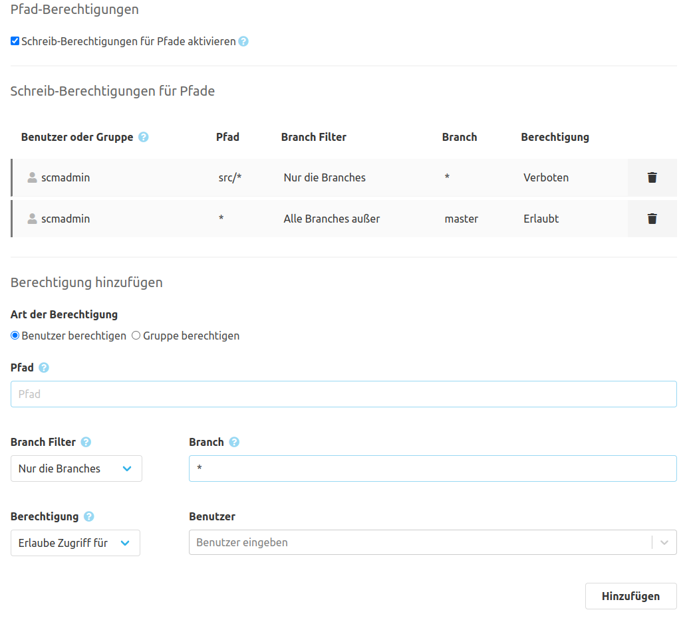

Zuallererst muss im Repository unter "Einstellungen" > "Pfad-Berechtigungen" die Checkbox aktiviert werden. Ab dann kann nur noch anhand der definierten Regeln auf diesem Repository geschrieben werden.

### Berechtigung hinzufügen
Nach Aktivieren der Schreib-Berechtigungen wird der Bereich "Berechtigung hinzufügen" sichtbar. In ihm können Benutzer und/oder Gruppen für Pfade berechtigt (oder ausgeschlossen) werden. Im Eingabefeld "Pfad" kann ein Pfadname oder Muster angegeben werden. Um ein komplettes Verzeichnis zu schützen, kann am Ende des Pfades "*\" verwendet werden.

Zum Beispiel:

* docs/*
* Jenkinsfile
* *.xml

Eine DENY Berechtigung wiegt stärker als eine ALLOW Berechtigung und kann diese außer Kraft setzen. Hierdurch kann nach einem generellen Berechtigen ein erneuter Ausschluss für bestimmter Teile ermöglicht werden.
