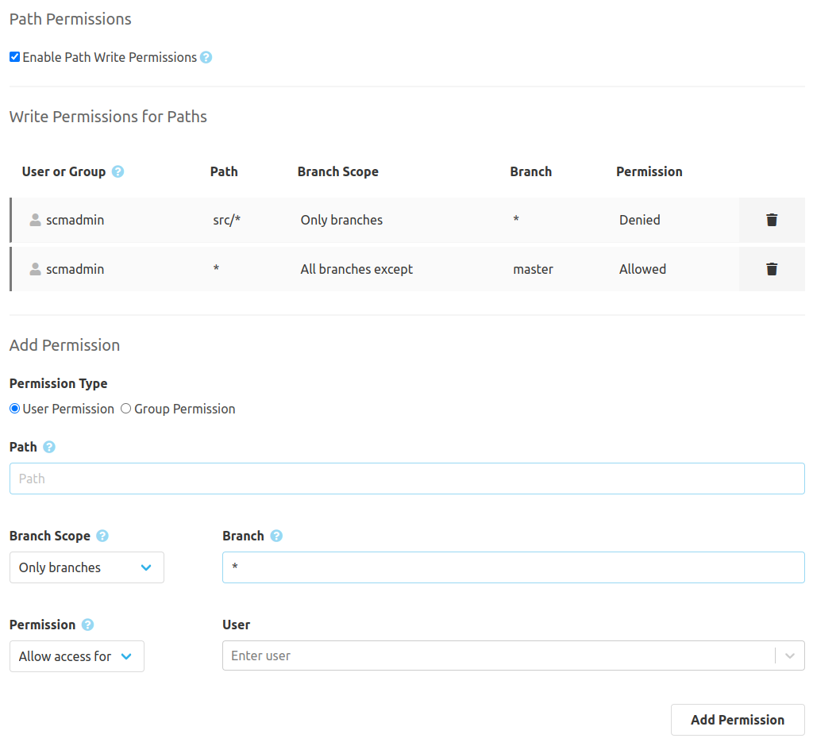

Once the feature is activated under "Settings" > "Path Permissions" the rules can be used to limit the write access to parts of the repository.

### Add permission
When the checkbox is activated, the areas "Write permissions for paths" and "Add permission" are visible. There you can see the current rules and set new ones. Rules can be used to allow or disallow users and groups the access to certain paths. The field "Path" can be used to provide a path or a pattern for several paths. To protect a complete folder an Asterix at the end of the path can be used.

Examples:

* docs/*
* Jenkinsfile
* *.xml

DENY permissions overrules ALLOW permissions. This allows to first generally allow complete write access and then to limit this access with additional rules.
